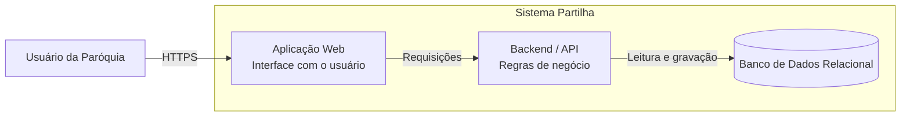
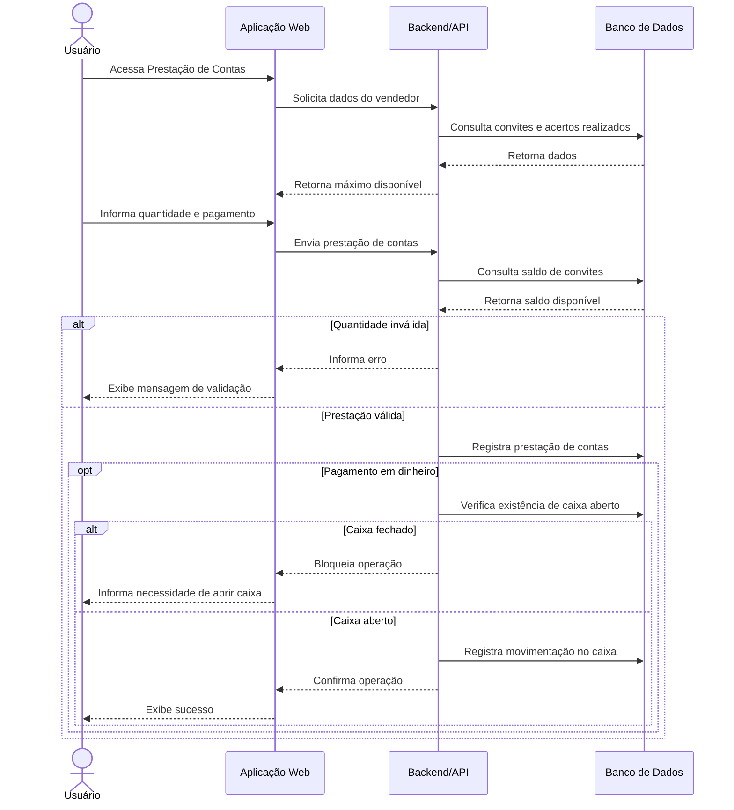

# Partilha – Sistema de Gestão de Igreja

## Visão geral

O **Partilha** é um sistema web para apoiar a gestão de eventos e atividades de uma paróquia. A solução centraliza processos que antes poderiam ser controlados manualmente ou por planilhas, oferecendo rastreabilidade operacional e financeira.

O sistema contempla cadastro de eventos, produtos e convites, distribuição de convites para vendedores, venda direta, prestação de contas, doações, controle de caixa, controle de estoque, dashboards e relatórios.

## Escopo e responsabilidades

A documentação adota uma visão arquitetural de alto nível, buscando representar os principais componentes, responsabilidades e fluxos críticos, sem detalhar classes e métodos.

Principais responsabilidades do sistema:

- Gerenciar eventos paroquiais.
- Controlar produtos e convites vinculados aos eventos.
- Distribuir convites para vendedores e acompanhar os acertos.
- Registrar vendas diretas e diferentes formas de pagamento.
- Registrar prestações de contas parciais ou concluídas.
- Controlar doações em dinheiro ou produtos.
- Controlar abertura, entradas, saídas e saldo do caixa.
- Controlar entradas, saídas e saldo de estoque.
- Consolidar informações em dashboards e relatórios.

## Limites e regras relevantes

Algumas regras de negócio são especialmente importantes:

- Movimentações em dinheiro que impactam o caixa dependem da existência de caixa aberto.
- Não deve ser possível abrir um novo caixa enquanto existir outro aberto.
- A prestação de contas deve respeitar a quantidade máxima de convites disponível para acerto.
- Uma saída de estoque não pode ultrapassar a quantidade disponível.
- As movimentações precisam manter consistência entre vendas, prestações de contas, caixa, estoque e indicadores.
- Registros cancelados ou excluídos não devem compor totalizações indevidas.

## Arquitetura

O sistema utiliza uma arquitetura de aplicação web, separando a interface utilizada pelos usuários, as regras de negócio executadas no backend e a persistência em banco de dados relacional.

O diagrama estrutural completo também está disponível em [`docs/architecture/containers.md`](docs/architecture/containers.md).

## Jornada crítica

Para representar o comportamento do sistema foi selecionada a jornada de **Prestação de Contas de Convites**, pois envolve validações de saldo, registro financeiro e regras relacionadas ao caixa.

O diagrama de sequência completo também está disponível em [`docs/flows/prestacao-contas.md`](docs/flows/prestacao-contas.md).

## Uso de GenAI e ajustes realizados

A GenAI foi utilizada como apoio para estruturar os diagramas em Mermaid. O modelo identificou corretamente a separação entre interface, regras de negócio e persistência e também representou a necessidade de consultas e validações antes da conclusão da prestação de contas.

Entretanto, alguns ajustes foram necessários. A primeira representação simplificava a prestação de contas como uma operação de cadastro. Foi necessário explicitar regras relacionadas à quantidade máxima disponível, forma de pagamento e situação do caixa.

Também foi necessário evitar a inclusão de componentes e integrações não confirmados. Quando uma decisão arquitetural não está documentada, um modelo pode preencher a lacuna com uma solução tecnicamente plausível, mas diferente daquela adotada pelo projeto.

## Lacunas de documentação

Para que um agente de desenvolvimento possa implementar ou evoluir o sistema com menor necessidade de inferir decisões, esta documentação ainda deverá ser complementada com:

- requisitos funcionais e não funcionais;
- catálogo completo de regras de negócio;
- modelo de dados e relacionamentos;
- contratos das APIs;
- autenticação, autorização e perfis de acesso;
- tratamento de erros;
- tecnologias, versões e padrões de desenvolvimento;
- estrutura do código-fonte;
- estratégia de testes;
- estratégia de implantação;
- integrações externas;
- ADRs (Architecture Decision Records) para decisões arquiteturais relevantes;
- diagramas de sequência das demais jornadas críticas.

Entre as jornadas que deverão receber documentação própria estão venda direta, distribuição de convites, movimentações de caixa, doações e controle de estoque.

## Conclusão

A abordagem **diagrams as code** permite manter os diagramas versionados junto ao código e à documentação do sistema. Além de facilitar revisão e atualização, esses artefatos podem ser fornecidos como contexto para agentes de desenvolvimento baseados em IA.

Quanto mais explícitos estiverem os limites, responsabilidades, regras de negócio e decisões arquiteturais, menor será a necessidade de o agente inventar decisões durante a implementação.

