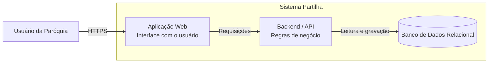

# Diagrama Estrutural – Visão de Containers

Este diagrama apresenta uma visão estrutural de alto nível do **Partilha – Sistema de Gestão de Igreja**, inspirada no nível de Containers do C4 Model.

## Responsabilidades

**Aplicação Web**

Responsável pela interação com o usuário, apresentação das telas, formulários, dashboards e relatórios.

**Backend / API**

Responsável pela execução das regras de negócio, validações, processamento das operações e acesso aos dados.

**Banco de Dados Relacional**

Responsável pela persistência das informações do sistema, incluindo eventos, produtos, convites, vendas, prestações de contas, doações, caixa e estoque.

## Limites desta visão

Este diagrama não representa classes, métodos, tabelas ou detalhes internos de implementação. Integrações externas somente deverão ser adicionadas quando estiverem efetivamente definidas e documentadas.
