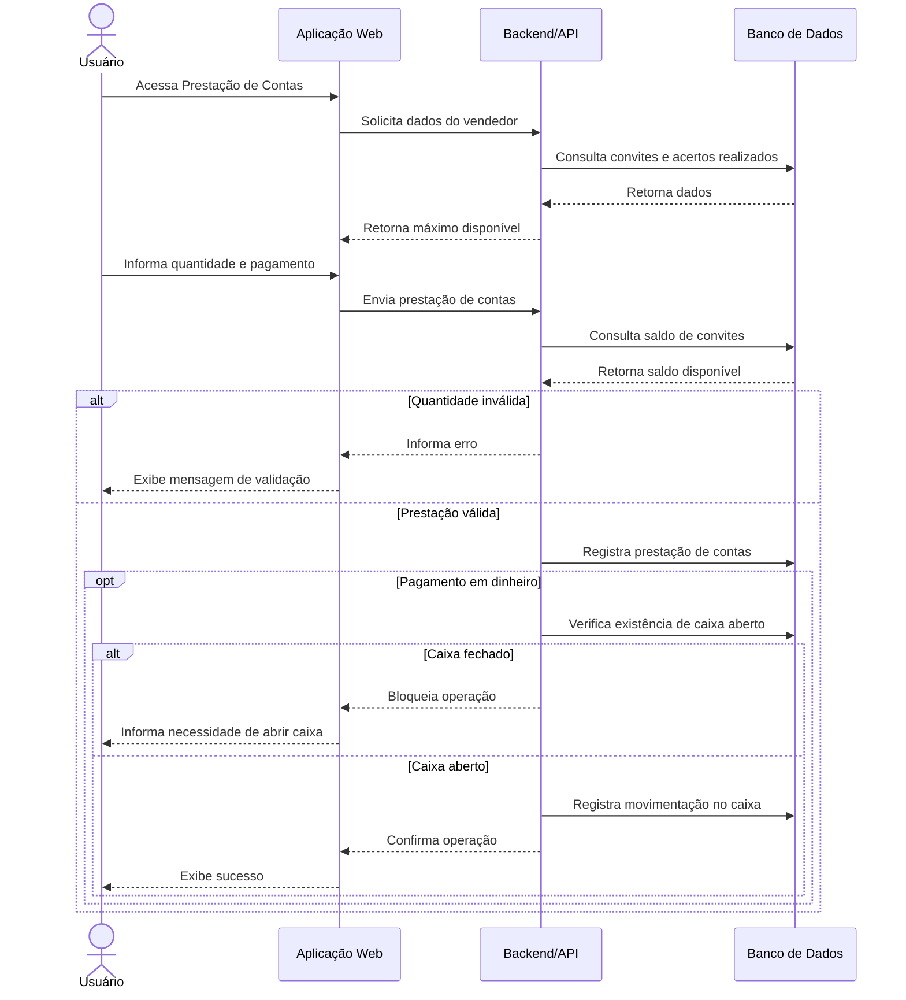

# Diagrama Comportamental – Prestação de Contas de Convites

A prestação de contas foi escolhida como jornada crítica porque envolve controle de convites, validações de negócio, formas de pagamento e movimentações financeiras.

## Regras representadas

1. O sistema consulta os convites e acertos existentes antes de apresentar o máximo disponível.
2. A quantidade informada na prestação de contas deve respeitar o saldo disponível.
3. Uma prestação inválida deve ser bloqueada e o usuário informado.
4. Quando houver recebimento em dinheiro, a operação deve considerar a situação do caixa.
5. Movimentações financeiras em dinheiro não devem ser registradas em um caixa inexistente ou fechado.

## Ajustes realizados após o uso da GenAI

A geração inicial foi revisada para evitar uma representação excessivamente simplificada da prestação de contas. Foram explicitadas as validações de quantidade disponível e a dependência do caixa para movimentações em dinheiro.

Também foi mantido apenas o comportamento conhecido do sistema, evitando que o modelo adicionasse integrações, serviços ou decisões arquiteturais que não estejam documentados.
